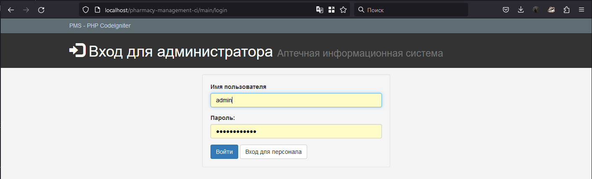
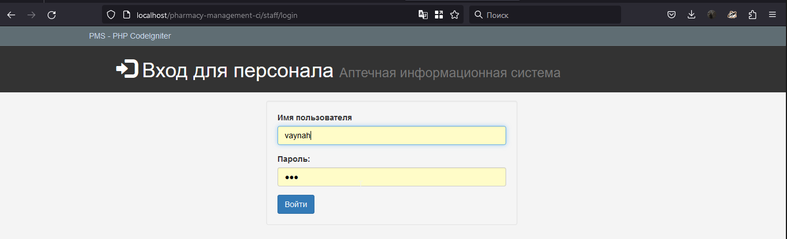
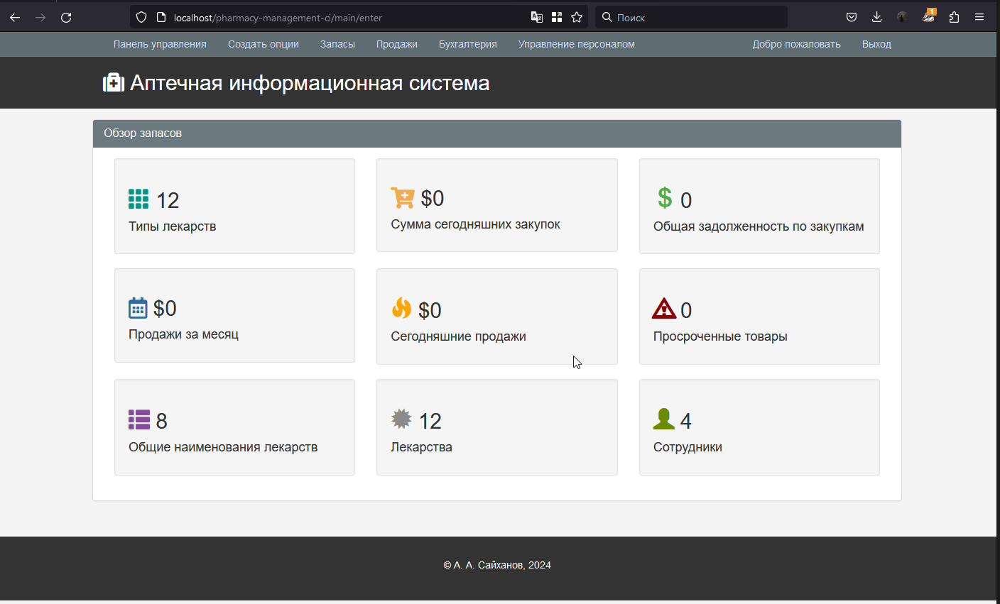
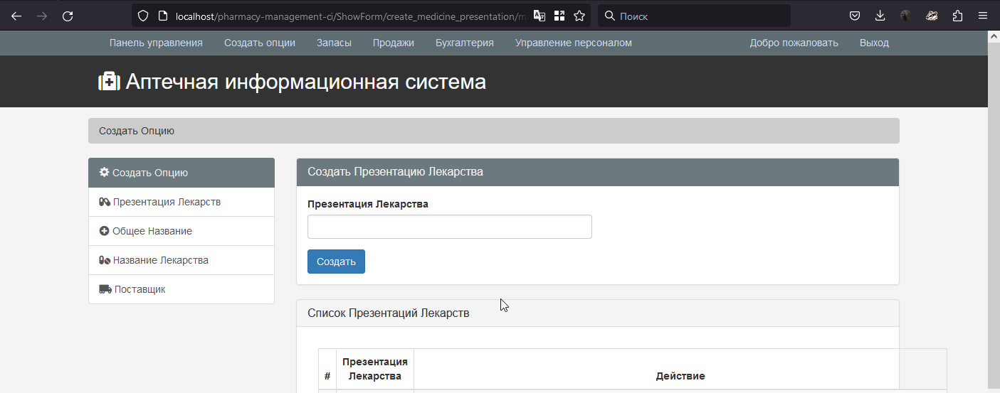
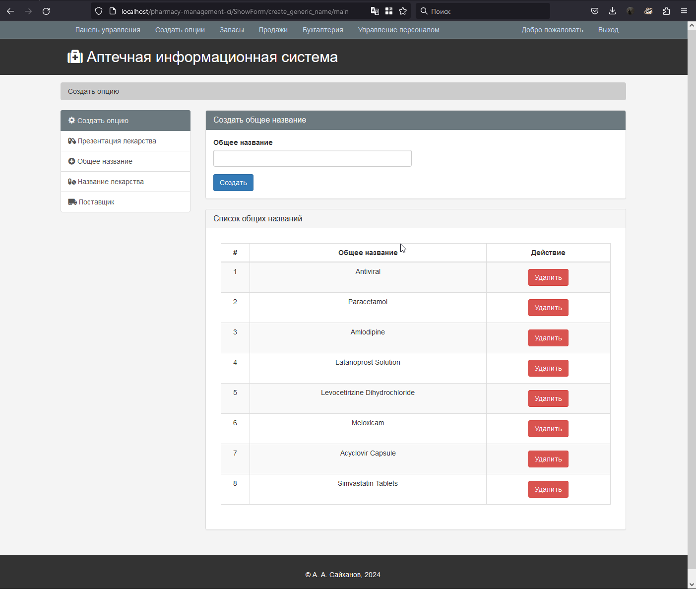
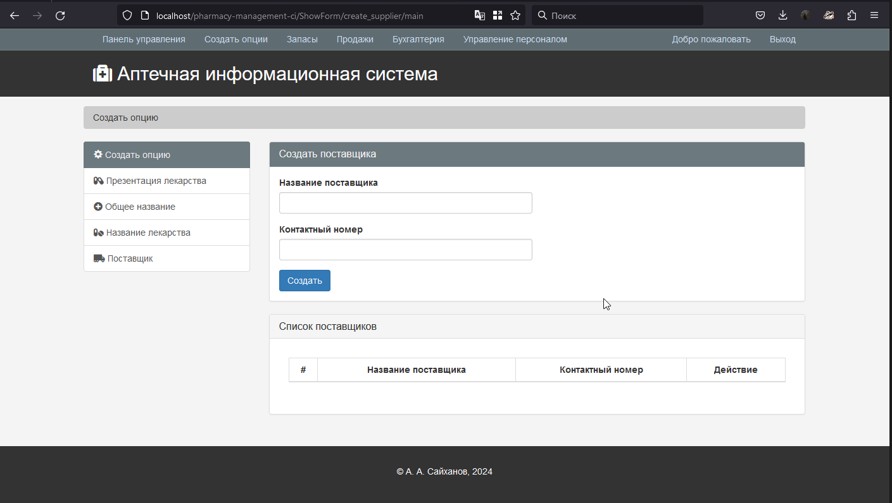
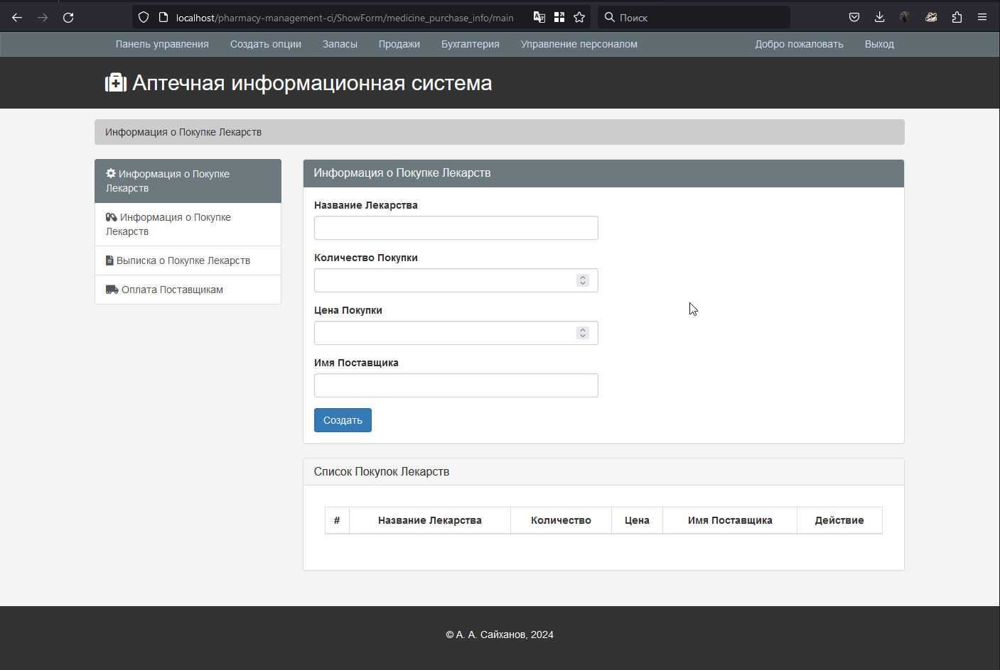
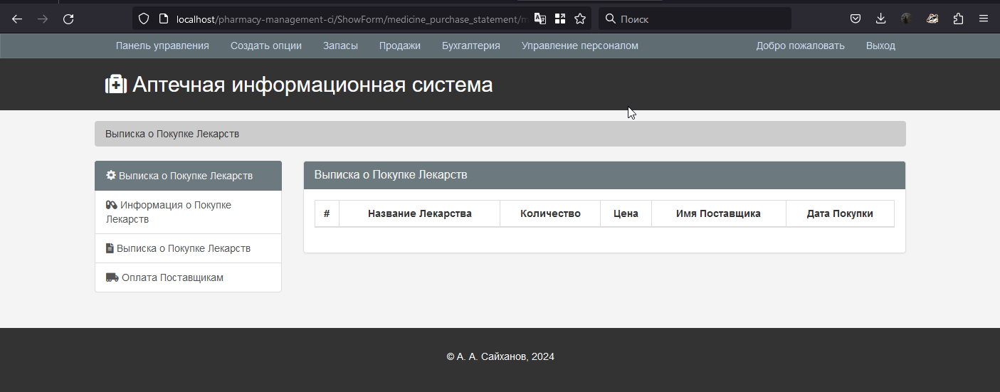
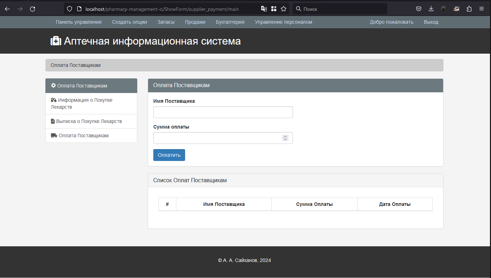

Инструкция: Как запустить?

1. После завершения загрузки проекта разархивируйте файл проекта и перейдите в каталог XAMPP.
2. Там вы найдете папку с названием «htdocs».
3. В папку «htdocs» вставьте папку проекта (не ZIP-файл, а извлеченный).
4. Откройте любимый браузер; мы рекомендуем использовать Google Chrome или Mozilla Firefox.
5. Затем перейдите по URL-адресу « http://localhost/phpmyadmin ».
6. Создайте базу данных с именем, которое указано в файле «01 LOGIN DETAILS & PROJECT INFO.txt».
7. Нажмите на вкладку «Импорт» и выберите файл базы данных (.sql), который находится в папке с названием «DATABASE FILE».
8. После настройки всех этих параметров перейдите по URL-адресу « http://localhost/[PROJECT_FOLDER_NAME] /».
9. Все данные для входа находятся в папке проекта, проверьте их и войдите, чтобы использовать. 

1 вход в панель админа

2 вход для персонала

3 ашборд с обзором ситуации по продажам и пр

4 презентация лекарств

5 создание общего названия

6 название лекарства

7 поставщик

8 инфа о покупке лекарств

9 выписка о покупке лекарств

10 оплата поставщиком

Источник оригинала будет позже
